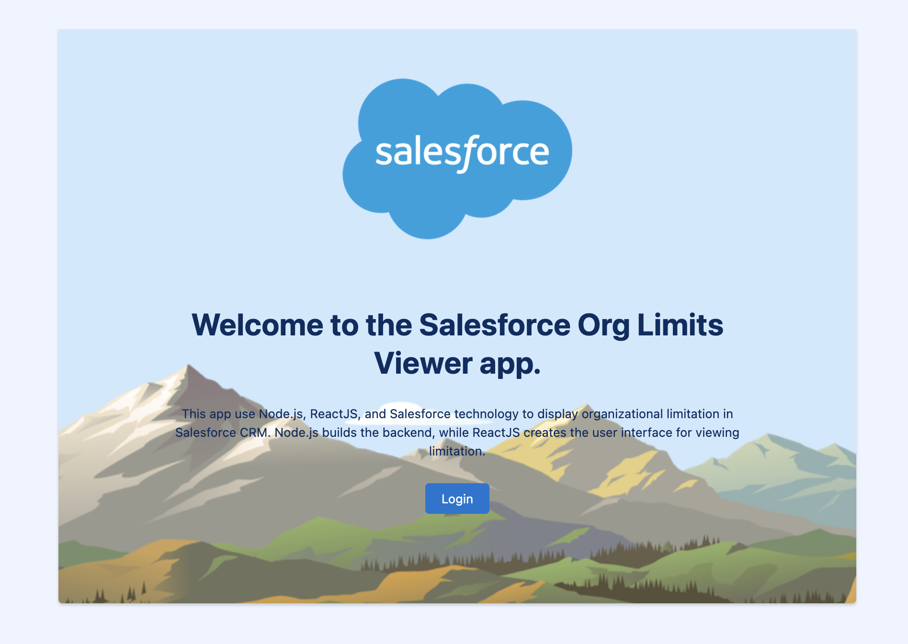

# Salesforce-Limits-Tracker
This app use Node.js, ReactJS, and Salesforce technology to display organizational limitation in Salesforce CRM. Node.js builds the backend, while ReactJS creates the user interface for viewing limitation.

This project drew inspiration from [Philippe Ozil](https://github.com/pozil/salesforce-react-integration/tree/master) work.

## About

- using [JSforce](https://jsforce.github.io) as a Salesforce client
  - authenticating with OAuth 2.0 (login, logout, retrieving session info)
- using the [Lightning Design System](https://www.lightningdesignsystem.com) (LDS) in a React application (all the CSS and icons of this app are provided by LDS)

The source code of this app is structured in the following way:

- the `client` directory holds the React app
- the `server` directory holds the node.js app that acts as a middleware with the Salesforce Platform

## Installation

1. Create a [Connected App](https://help.salesforce.com/articleView?id=connected_app_create.htm) in Salesforce.

1. Create a `.env` file in the root directory of this project and add this content (make sure to replace the values):

   ```
   loginUrl='https://login.salesforce.com'
   callbackUrl='http://localhost:3002/auth/callback'
   consumerKey='YOUR_CLIENT_KEY'
   consumerSecret='YOUR_CLIENT_SECRET'
   apiVersion='55.0'

   isHttps='false'
   sessionSecretKey='A_SECRET_STRING'
   ```

2. Run `npm install` to install the dependency package.

3. Run `npm run dev` to start the app.

## Screenshots

<div align="center">
	
	
</div>
